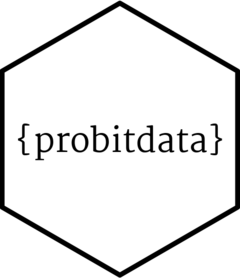

<!-- README.md is generated from README.Rmd. Please edit that file -->

# Manage Choice Data 

<!-- badges: start -->

[](https://github.com/loelschlaeger/choicedata/actions/workflows/R-CMD-check.yaml)
[](https://CRAN.R-project.org/package=choicedata)
[](https://app.codecov.io/gh/loelschlaeger/choicedata?branch=master)
<!-- badges: end -->

The `{choicedata}` R package provides a set of objects and functions
designed to facilitate the simulation, reading and visualization of
choice data generated by various types of choice models (including
binary, multinomial, ordered, ranked, mixed, and latent class probit and
logit models). It also contains a function to compute the likelihood of
these models for given data, but this is only for completeness, there
are much more efficient alternatives, see for example Bauer et al.
([2023](#ref-Bauer:2023)).

## Installation

You can install the released package version from
[CRAN](https://CRAN.R-project.org) with:

``` r
install.packages("choicedata")
```

## Package design

A choice model is of the form

$$
U_{nt} = X_{nt} \beta + \epsilon_{nt}, \quad \epsilon_{nt} \sim N_J(0, \Sigma), \quad y_{nt} = \arg \max U_{nt}.
$$ That means, the discrete choice $y_{nt} \in \{1,\dots,J\}$ of decider
$n$ at choice occasion $t$ is explained as the sum of a linear
combination of choice covariates $X_{nt}$ and coefficients $\beta$ and a
multivariate Gaussian error $\epsilon_{nt}$, which together is called
random (or latent) utility $U_{nt} \in \mathbb{R}^J$. Assuming utility
maximizing behavior of the decider, the choice $y_{nt}$ is linked to the
highest entry of $U_{nt}$. For more details, see Train
([2009](#ref-Train:2009)) and Bhat ([2011](#ref-Bhat:2011)).

The matrix of choice covariates $X_{nt}$ (also called *design matrix*)
is of dimension $J \times P$, where $P$ equals the length of $\beta$ and
is the number of model effects. Choice covariates can either vary across
alternatives (for example the alternative’s price) or be constant across
alternatives (for example the decider’s age). Each choice covariate can
either be connected to multiple, alternative-specific coefficients or to
just a single, alternative-constant coefficient (but only if the
covariate varies across alternatives). So the $j$-th row of the utility
system above can be written more explicit as

$$
U_{ntj} = X_{ntj}^{(1)} \beta^{(1)} + X_{nt}^{(2)} \beta_j^{(2)} + X_{ntj}^{(3)} \beta_j^{(3)} + \epsilon_{ntj}
$$ and we can (and should) distinguish between type-1, type-2, and
type-3 covariates.

If $J = 2$, this model is a *binary* choice model. If $J > 2$, it is
called *multinomial* choice model. If the choice set $\{1, \dots, J\}$
has a logical ordering (for example items on a Likert scale), it is
called *ordered* choice model. If deciders provide a full ranking of the
choice alternatives, it is a *ranked* choice model. To model choice
behavior heterogeneity across deciders, we can include random effects by
letting (a part of) the coefficient vector follow a (typically normal or
log-normal) distribution. This model is called *mixed* choice model. If
the distribution is a latent mixture of distributions, or the population
of deciders is separated into subgroups, the model becomes a *latent
class* model.

What should have become clear from the above is that choice models
consist of multiple parts (like the choice set, different types of
covariates, the model formula etc.) that must be combined to work with
this model class in `R`. This is the goal of the `{choicedata`} package.
It provides the following S3 objects to represent these parts:

| S3 object             | Part                                            |
|-----------------------|-------------------------------------------------|
| `choice_formula`      | defines the formula for a choice model          |
| `choice_alternatives` | defines the choice alternatives                 |
| `choice_set`          | defines the choice set                          |
| `choice_effects`      | defines the choice model effects                |
| `choice_covariates`   | defines the model covariates                    |
| `choice_parameters`   | defines the parameters of a choice model        |
| `choices`             | defines the decider’s choices                   |
| `choice_data`         | defines the model data (covariates and choices) |

These objects can be created via eponymous constructors, but for
specific tasks the package provides the following user-friendly helper
functions and methods:

| Task                                              | Function / S3 method                                                   |
|---------------------------------------------------|------------------------------------------------------------------------|
| Read choice data from a `data.frame`              | `read_choice_data()` (creates a `choice_data` object)                  |
| Simulate choice data from a choice model          | `simulate_choice_data()` (creates a `choice_data` object)              |
| Sample covariates (with custom correlations etc.) | `sample_choice_covariates()` (creates a `choice_covariates` object)    |
| Compute the number of model effects               | `compute_P()` (and `choice_effects()` provides an overview             |
| Transform choice data to design matrix form       | `as.list.choice_data()` (creates a `list` of design matrices)          |
| Visualize choice data                             | `plot.choice_data()` (creates a `ggplot` object)                       |
| Sample parameters for a choice model              | `sample_choice_parameters()` (creates a `choice_parameters` object)    |
| Compute the model likelihood                      | `choice_likelihood()`                                                  |
| Create a `vector` of identified model parameters  | `as.vector.choice_parameters()` (required for likelihood optimization) |

## Examples

### Binary probit model

``` r
data(Train, package = "mlogit")
```

### Multinomial probit model

### Ordered probit model

### Ranked probit model

### Mixed probit model

simulate

### Latent class probit model

simulate

## Contact

You have a question, found a bug, request a feature, want to give
feedback, or like to contribute? It would be great to hear from you,
[please file an issue on
GitHub](https://github.com/loelschlaeger/choice_data/issues/new/choose).
😊

## References

<div id="refs" class="references csl-bib-body hanging-indent">

<div id="ref-Bauer:2023" class="csl-entry">

Bauer, Dietmar, Manuel Batram, Sebastian Büscher, and Lennart
Oelschläger. 2023. *Rprobit: Estimation of Multinomial Probit Models*.

</div>

<div id="ref-Bhat:2011" class="csl-entry">

Bhat, C. 2011. “The Maximum Approximate Composite Marginal Likelihood
(MACML) Estimation of Multinomial Probit-Based Unordered Response Choice
Models.” *Transportation Research Part B: Methodological* 45.

</div>

<div id="ref-Train:2009" class="csl-entry">

Train, K. 2009. *Discrete Choice Methods with Simulation*. 2. ed.
Cambridge Univ. Press.

</div>

</div>
