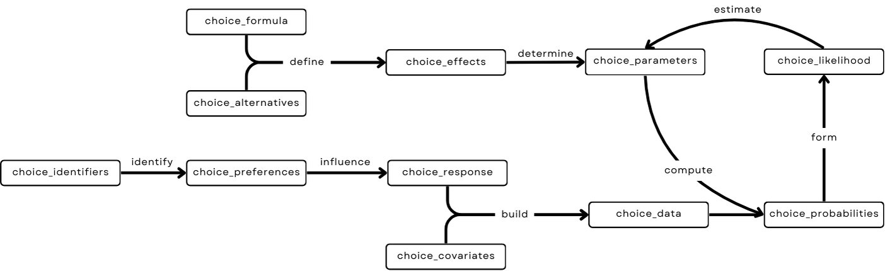

<!-- README.md is generated from README.Rmd. Please edit that file -->

# Choice Data in R 

<!-- badges: start -->

[](https://CRAN.R-project.org/package=choicedata)
[](https://github.com/loelschlaeger/choicedata/actions/workflows/R-CMD-check.yaml)
[](https://app.codecov.io/gh/loelschlaeger/choicedata)
<!-- badges: end -->

The `{choicedata}` package simplifies working with choice data in
[R](https://www.r-project.org/).

## Installation

Install the released version from
[CRAN](https://CRAN.R-project.org/package=choicedata):

``` r
install.packages("choicedata")
```

## Package design

The package breaks choice-data modeling into a series of objects. Each
object contains the information needed for the next step.



- [`choice_formula`](https://loelschlaeger.de/choicedata/reference/choice_formula.html):
  the choice model formula.

- [`choice_alternatives`](https://loelschlaeger.de/choicedata/reference/choice_alternatives.html):
  the set of choice alternatives.

- [`choice_effects`](https://loelschlaeger.de/choicedata/reference/choice_effects.html):
  the choice effects, defined by `choice_alternatives` and
  `choice_formula`.

- [`choice_parameters`](https://loelschlaeger.de/choicedata/reference/choice_parameters.html):
  the model parameters, determined by `choice_effects` and estimated via
  `choice_likelihood`.

- [`choice_identifiers`](https://loelschlaeger.de/choicedata/reference/choice_identifiers.html):
  the identifiers for deciders and choice occasions.

- [`choice_preferences`](https://loelschlaeger.de/choicedata/reference/choice_preferences.html):
  the choice preferences of the deciders, identified by
  `choice_identifiers`.

- [`choice_responses`](https://loelschlaeger.de/choicedata/reference/choice_responses.html):
  the choice responses, influenced by `choice_preferences`.

- [`choice_covariates`](https://loelschlaeger.de/choicedata/reference/choice_covariates.html):
  the choice covariates.

- [`choice_data`](https://loelschlaeger.de/choicedata/reference/choice_data.html):
  the choice data, built by `choice_covariates` and `choice_responses`.

- [`choice_probabilities`](https://loelschlaeger.de/choicedata/reference/choice_probabilities.html):
  the choice probabilities, computed from `choice_data` and
  `choice_parameters`.

- [`choice_likelihood`](https://loelschlaeger.de/choicedata/reference/choice_likelihood.html):
  the likelihood of the choice model, formed by `choice_probabilities`.

The objects are designed to be modular and can be combined in various
ways to create a range of modeling workflows.

## Examples

### Empirical data

The `travel_mode_choice` data set contains the revealed preferences of
210 travelers choosing between plane, train, bus, and car:

``` r
library("choicedata")
travel_mode_choice
#> # A tibble: 840 × 8
#>    individual mode  choice  wait  cost travel income  size
#>         <int> <chr>  <int> <int> <dbl>  <int>  <dbl> <int>
#>  1          1 plane      0    69 36.4     100   21.6     1
#>  2          1 train      0    34 19.1     372   21.6     1
#>  3          1 bus        0    35 15.4     417   21.6     1
#>  4          1 car        1     0  6.17    180   21.6     1
#>  5          2 plane      0    64 35.8      68   18.5     2
#>  6          2 train      0    44 19.1     354   18.5     2
#>  7          2 bus        0    53 15.4     399   18.5     2
#>  8          2 car        1     0  6.79    255   18.5     2
#>  9          3 plane      0    69 71.0     125   24.7     1
#> 10          3 train      0    34 60.5     892   24.7     1
#> # ℹ 830 more rows
```

We can transform the data from long (one row per choice alternative) to
wide format (one row per choice occasion):

``` r
long_to_wide(
  data_frame = travel_mode_choice,
  column_alternative = "mode",
  column_decider = "individual"
)
#> # A tibble: 210 × 16
#>    individual income  size wait_plane wait_train wait_bus wait_car cost_plane
#>         <int>  <dbl> <int>      <int>      <int>    <int>    <int>      <dbl>
#>  1          1  21.6      1         69         34       35        0       36.4
#>  2          2  18.5      2         64         44       53        0       35.8
#>  3          3  24.7      1         69         34       35        0       71.0
#>  4          4  43.2      3         64         44       53        0       30.3
#>  5          5  27.8      2         64         44       53        0       37.0
#>  6          6  12.3      1         69         40       35        0       36.4
#>  7          7  27.8      1         45         34       35        0       91.4
#>  8          8   7.41     1         69         34       35        0       74.7
#>  9          9  24.7      1         69         34       35        0       36.4
#> 10         10  43.2      2         69         34       35        0       35.8
#> # ℹ 200 more rows
#> # ℹ 8 more variables: cost_train <dbl>, cost_bus <dbl>, cost_car <dbl>,
#> #   travel_plane <int>, travel_train <int>, travel_bus <int>, travel_car <int>,
#> #   choice <chr>
```

We can construct model design matrices:

``` r
mode_effects <- choice_effects(
  choice_formula = choice_formula(
    formula = choice ~ cost | income | wait,
    error_term = "probit"
  ),
  choice_alternatives = choice_alternatives(
    J = 4,
    alternatives = unique(travel_mode_choice$mode)
  )
)

mode_data <- choice_data(
  data_frame = travel_mode_choice,
  format = "long",
  column_choice = "choice",
  column_decider = "individual",
  column_alternative = "mode",
  column_ac_covariates = c("income", "size"),
  column_as_covariates = c("wait", "cost", "travel")
)

mode_design <- design_matrices(mode_data, mode_effects)
mode_design[[1]] |> round()
#>       cost income_car income_plane income_train ASC_car ASC_plane ASC_train
#> bus     15          0            0            0       0         0         0
#> car      6         22            0            0       1         0         0
#> plane   36          0           22            0       0         1         0
#> train   19          0            0           22       0         0         1
#>       wait_bus wait_car wait_plane wait_train
#> bus         35        0          0          0
#> car          0        0          0          0
#> plane        0        0         69          0
#> train        0        0          0         34
```

### Simulated choice

`generate_choice_data()` makes it straightforward to simulate choice
data. The example below simulates 200 ranking tasks with three
alternatives and recovers the data-generating parameters by optimizing
the likelihood:

``` r
library("choicedata")

set.seed(1)

sim_effects <- choice_effects(
  choice_formula = choice_formula(
    formula = choice ~ x | y + 0 | z,
    error_term = "logit"
  ),
  choice_alternatives = choice_alternatives(
    J = 3,
    alternatives = c("A", "B", "C")
  )
)

sim_parameters <- generate_choice_parameters(sim_effects)

(sim_data <- generate_choice_data(
  choice_effects = sim_effects,
  choice_identifiers = generate_choice_identifiers(N = 200),
  choice_parameters = sim_parameters,
  choice_type = "ranked"
))
#> # A tibble: 200 × 13
#>    deciderID occasionID choice       y    x_A     x_B     x_C     z_A    z_B
#>  * <chr>     <chr>      <chr>    <dbl>  <dbl>   <dbl>   <dbl>   <dbl>  <dbl>
#>  1 1         1          B      -0.621   0.487  0.738   0.576  -0.305   1.51 
#>  2 2         1          A       0.594  -2.21   1.12   -0.0449 -0.0162  0.944
#>  3 3         1          C      -0.156   0.919  0.782   0.0746 -1.99    0.620
#>  4 4         1          A      -0.0538 -1.47  -0.478   0.418   1.36   -0.103
#>  5 5         1          B      -0.165  -1.38  -0.415  -0.394  -0.0593  1.10 
#>  6 6         1          A       0.769  -0.253  0.697   0.557  -0.689  -0.707
#>  7 7         1          B       1.43   -0.112  0.881   0.398  -0.612   0.341
#>  8 8         1          B      -0.0392  1.98  -0.367  -1.04    0.570  -0.135
#>  9 9         1          A       0.153   0.690  0.0280 -0.743   0.189  -1.80 
#> 10 10        1          C       0.291   2.17   0.476  -0.710   0.611  -0.934
#> # ℹ 190 more rows
#> # ℹ 4 more variables: z_C <dbl>, choice_A <int>, choice_B <int>, choice_C <int>

sim_likelihood <- choice_likelihood(
  choice_data = sim_data,
  choice_effects = sim_effects
)

true_vector <- switch_parameter_space(
  choice_parameters = sim_parameters,
  choice_effects = sim_effects
)

fit <- stats::optim(
  par = stats::rnorm(length(true_vector)),
  fn = function(par) {
    compute_choice_likelihood(
      choice_parameters = par,
      choice_likelihood = sim_likelihood,
      logarithm = TRUE,
      negative = TRUE
    )
  }
)

estimated_parameters <- switch_parameter_space(
  choice_parameters = fit$par,
  choice_effects = sim_effects
)

data.frame(dgp = true_vector, estimated = fit$par) |> round(2)
#>          dgp estimated
#> beta_1 -1.98     -2.36
#> beta_2  0.58      0.53
#> beta_3 -2.64     -2.83
#> beta_4  5.04      5.64
#> beta_5  1.04      1.18
#> beta_6 -2.59     -3.03
```

## Related work

`{Rprobit}` ([Bauer et al. 2023](#ref-Bauer2023)) provides maximum
approximated composite marginal likelihood estimation for efficient
probit choice modeling.

`{RprobitB}` ([Oelschläger and Bauer 2025](#ref-Oelschlaeger2025))
provides Bayesian tools for estimating probit models.

## Contact

You have a question, found a bug, or want to contribute? Please [file an
issue on
GitHub](https://github.com/loelschlaeger/choicedata/issues/new/choose).

## References

<div id="refs" class="references csl-bib-body hanging-indent">

<div id="ref-Bauer2023" class="csl-entry">

Bauer, D., M. Batram, S. Büscher, and L. Oelschläger. 2023. *Rprobit:
Estimation of Multinomial Probit Models*.
<https://github.com/dbauer72/Rprobit>.

</div>

<div id="ref-Oelschlaeger2025" class="csl-entry">

Oelschläger, L., and D. Bauer. 2025. *RprobitB: Bayesian Probit Choice
Modeling*. <https://CRAN.R-project.org/package=RprobitB>.

</div>

</div>
